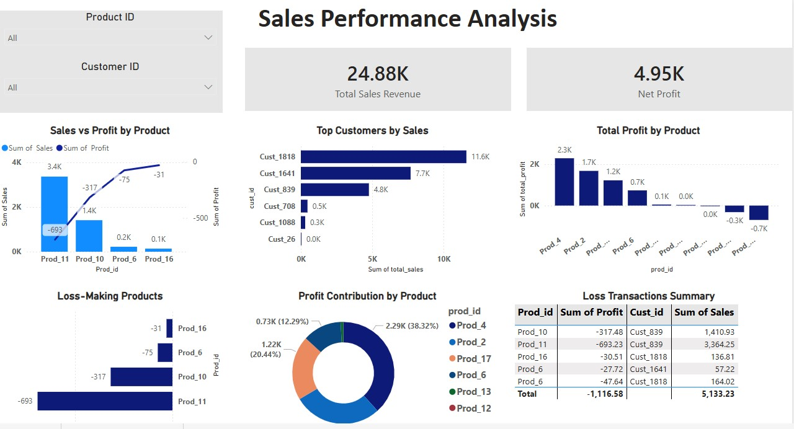

# Sales Performance Analysis Dashboard

## Project Overview

This project presents an end-to-end **Sales Performance Analysis Dashboard** 
built using **Power BI, SQL, and Excel** for a retail business dealing with 
multiple products and customers across different regions.

The goal of this project is to analyze sales trends, identify profit and loss 
patterns, understand customer behavior, and provide actionable business 
recommendations through interactive visualizations.

---

## Objectives

- Analyzed sales performance across multiple products
  and customers to identify revenue and profit drivers
- Identified top-performing customers contributing the
  most to overall business sales
- Detected loss-making transactions caused by heavy
  discounting on low-margin products
- Evaluated product-level profitability to distinguish
  between profit-generating and loss-making products
- Investigated the impact of discount rates (1%–10%)
  on overall profit margins
- Designed a Star Schema database in MySQL to efficiently
  store and query sales transaction data
- Delivered actionable business recommendations through
  an interactive Power BI dashboard

---

## Features

- **Top Customer Analysis** — Ranked customers by total
  sales: Cust_1818 (₹11,615), Cust_1641 (₹7,701),
  Cust_839 (₹4,775) identified as top 3 revenue drivers
- **Product Profit Tracking** — Profitability analysis
  across 9 products: Prod_4 (₹2,286), Prod_2 (₹1,675),
  and Prod_17 (₹1,219) are top profit generators
- **Loss Transaction Detection** — Flagged 5 loss
  transactions with combined losses of ₹1,116 caused
  by discounts of 1%–10% on low base-margin products
- **Discount Impact Analysis** — Identified that even
  small discounts (1–3%) on products like Prod_16 and
  Prod_6 result in negative profit
- **Loss-Making Product Identification** — Prod_11
  (-₹693), Prod_10 (-₹317), and Prod_16 (-₹7) flagged
  for pricing strategy review
- **Star Schema Design** — Fact and dimension tables
  built in MySQL for structured and scalable data storage
- **Interactive Power BI Dashboard** — KPI cards, filters,
  and drill-down visuals for dynamic sales exploration
- **Shipping Cost Analysis** — High shipping costs
  (₹61.76 on Ord_2207) identified as a contributing
  factor to loss transactions
  
---

## Key Insights

###  Product Performance
- **Prod_4** is the highest profit-generating product at **₹2,286.81**, 
  followed by Prod_2 (₹1,675.98) and Prod_17 (₹1,219.87)
- **3 out of 9 products are loss-making** — Prod_11 (-₹693.23), 
  Prod_10 (-₹317.48), and Prod_16 (-₹7.39)
- Total losses from loss-making products: **-₹1,018.10**
- Top 3 products offset all losses and generate **₹5,182.66 net profit**

###  Customer Insights
- **Cust_1818** is the top customer contributing **₹11,615.83** in sales — 
  50% more than the second-highest customer
- Top 3 customers (Cust_1818, Cust_1641, Cust_839) drive the 
  **majority of total revenue**
- Heavy revenue concentration in top 2 customers is a **business risk** 
  — bottom 3 customers contribute less than 4% of sales

###  Loss Analysis
- **Prod_11 and Prod_10** from the same order (Ord_2207) caused 
  combined losses of **-₹1,010.71** despite generating ₹4,775 in sales
- Discounts of **8–10%** on low-margin products are the primary 
  cause of loss transactions
- **Prod_6** appears in multiple loss transactions — 
  recommend reviewing its pricing strategy 

---

## Tools Used

- Power BI  
- SQL  
- Excel

---  

## Files Included

- Power BI Dashboard (.pbix)  
- Dashboard Screenshot  
- Dataset
- Excel Sheets (.csv files) 

---

## Dashboard Preview

